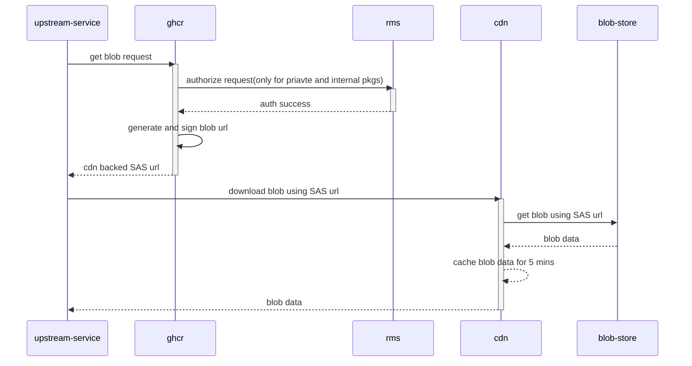

```mermaid
sequenceDiagram
    upstream-service->>ghcr: get blob request
    activate ghcr
    ghcr ->> rms: authorize request(only for priavte and internal pkgs)
    activate rms
    rms -->> ghcr: auth success
    deactivate rms
    ghcr ->> ghcr: generate and sign blob url
    ghcr-->> upstream-service: cdn backed SAS url
    deactivate ghcr
    upstream-service ->> cdn: download blob using SAS url
    activate cdn
    cdn ->>blob-store: get blob using SAS url
    blob-store -->> cdn: blob data
    cdn -->> cdn : cache blob data for 5 mins
    cdn -->> upstream-service: blob data
    deactivate cdn
    
    
```
