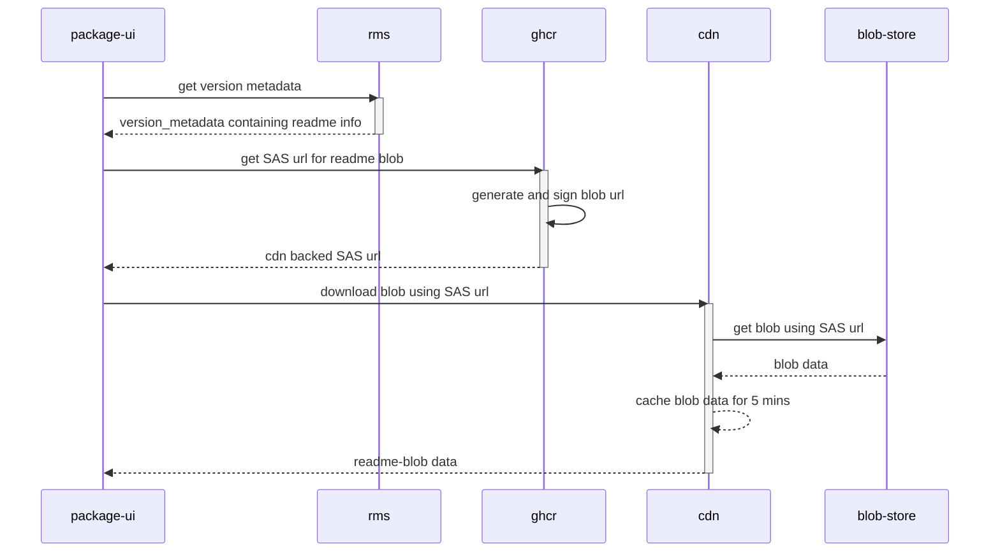

```mermaid
sequenceDiagram
    package-ui ->> rms: get version metadata
    activate rms
    rms -->> package-ui: version_metadata containing readme info
    deactivate rms
    package-ui ->> ghcr: get SAS url for readme blob
    activate ghcr
    ghcr ->> ghcr: generate and sign blob url
    ghcr-->> package-ui: cdn backed SAS url
    deactivate ghcr
    package-ui ->> cdn: download blob using SAS url
    activate cdn
    cdn ->>blob-store: get blob using SAS url
    blob-store -->> cdn: blob data
    cdn -->> cdn : cache blob data for 5 mins
    cdn -->> package-ui: readme-blob data
    deactivate cdn
    
    
```
